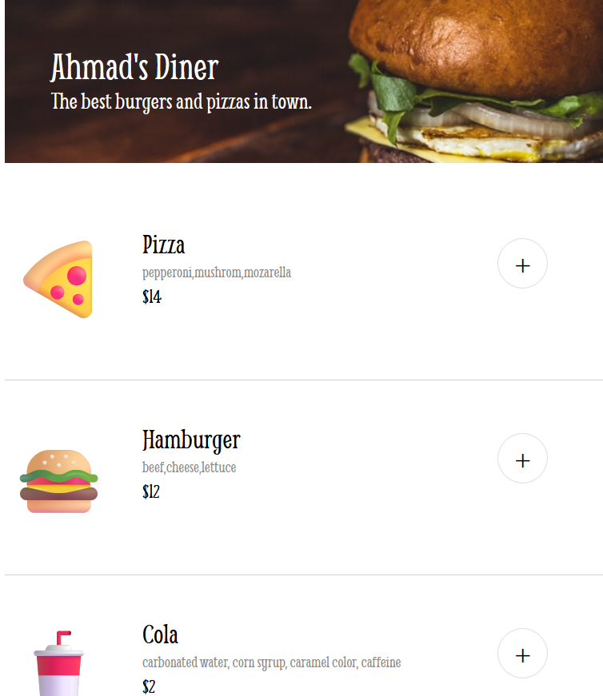
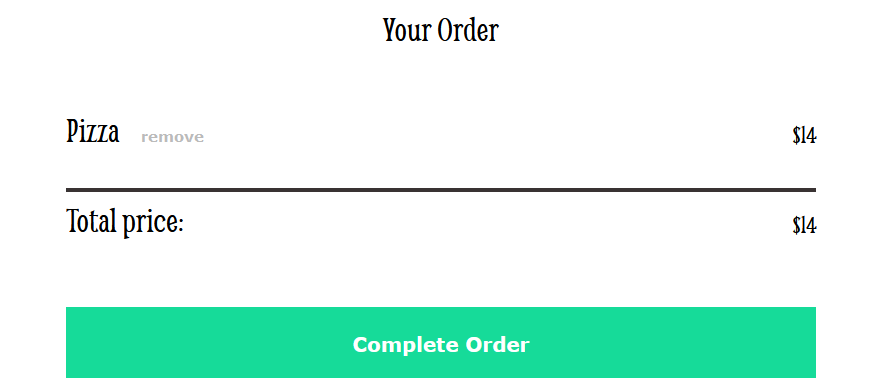
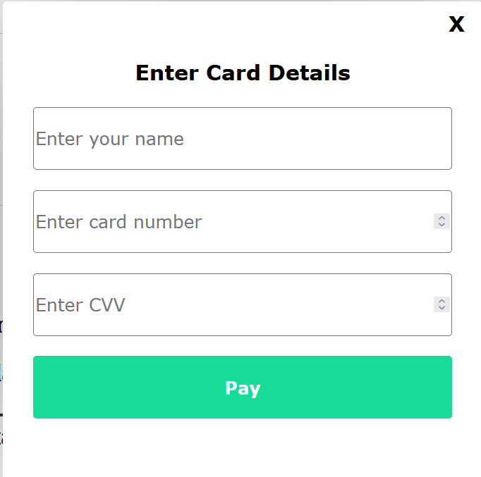
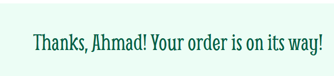

# Ahmad Diner

Ahmad Diner is an interactive web application designed to manage a diner menu. Utilizing HTML, CSS, and JavaScript, the application offers a dynamic and user-friendly experience.

## Live Demo

Experience the live application here: [Ahmad Diner](https://ahmaddiner.netlify.app/)

## Features

- **Menu Display**: Presents a comprehensive list of menu items, each with descriptions and prices.
- **Interactive Interface**: Allows users to select and add items to their order seamlessly.
- **Responsive Design**: Ensures optimal viewing across various devices and screen sizes.
- **Dynamic Functionality**: Implements interactive elements using JavaScript for enhanced user engagement.

## Screenshots

Here are some screenshots of the application:







## File Structure

- `index.html`: The main HTML file that structures the content of the webpage.
- `index.css`: The CSS file for styling the page and making it visually appealing.
- `index.js`: The JavaScript file that controls the interactive elements of the menu.
- `data.js`: Contains data for the menu items such as name, description, and price.
- `images/`: Directory for storing images used in the diner menu.

## Installation

To set up the project locally:

1. Clone the repository:
   ```bash
   git clone https://github.com/ahmadkhatib02/ahmad-diner.git
   ```

2. Navigate to the project directory:
   ```bash
   cd ahmad-diner
   ```

3. Open `index.html` in your preferred web browser to view the application.

## Contributing

Contributions are welcome. To contribute:

1. Fork the repository.
2. Create a new branch for your feature or fix.
3. Commit your changes with descriptive messages.
4. Push to your forked repository.
5. Submit a pull request detailing your changes.

Please ensure that your contributions are well-documented and tested.

## Author

This project was created by **Ahmad Khatib**. For inquiries, you can reach out to me via [email] (mailto:ahmadalkkhatib@gmail.com) or visit my [GitHub profile](https://github.com/ahmadkhatib02) or [LinkedIn profile](https://www.linkedin.com/in/ahmadalkhatib01/).

## Acknowledgments

We appreciate the open-source community for providing resources and tools that have been instrumental in the development of this project.
